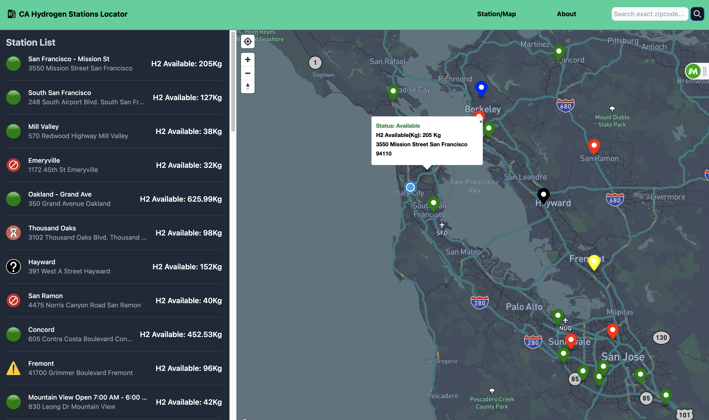

#### fullstack application that allows hydrogen car drivers locate hydrogen stations quickly and in a mobile friendly way

## Notable features

* Get status of Hydrogen station with updates to the status every minute
* Interactive map with the location of each hydrogen location
* List of the hydrogen station location with address
* Application is able to get the user's location and short the station closes to the user
* Filter the hydrogen station via zipcode

## Preview of the application

## technologies
* React/Typescript
* Tailwind
* mapbox

## setup:
* clone this repo
* in the project directory, you can run:
## `npm start`
runs the app in the development mode.
open [http://localhost:3000](http://localhost:3000) to view it in your browser.*

#### *this application relies on the hydrogen station backend to function

* link to the backend api (https://github.com/stzheng716/hydrogen_station_node_express_backend)